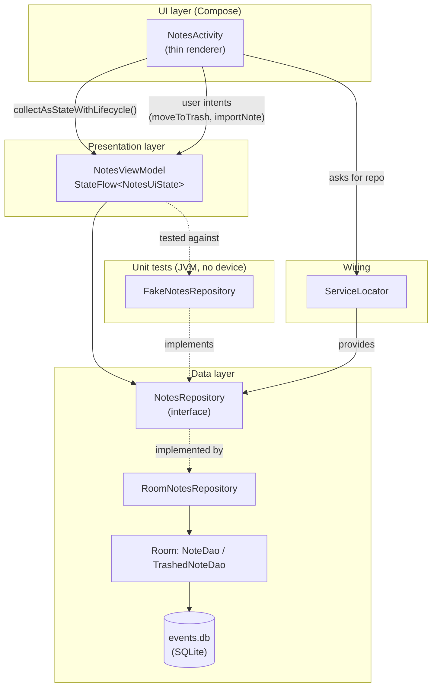

# Architecture

Multi is a single-module Android app written in **Kotlin** with a **Jetpack
Compose** UI and **Room** persistence. It is migrating, feature by feature, from
"logic-in-the-Activity" toward a testable **MVVM + repository** architecture.

## Layers

### UI layer — `NotesActivity`

Holds **no business logic and no data**. It collects an immutable
`NotesUiState` from the ViewModel with `collectAsStateWithLifecycle()` and
forwards user actions (delete selection, import file) as function calls. Purely
visual state — selection mode, which rows are checked, whether the share menu is
open — stays local to the composable via `remember`.

### Presentation layer — `NotesViewModel`

* Exposes a single `StateFlow<NotesUiState>` built by `combine`-ing the notes
  stream with a transient error channel, then `stateIn(WhileSubscribed(5s))` so
  collection stops shortly after the screen goes to the background and resumes
  on return.
* The list is **reactive**: it is derived from a Room `Flow`, so edits made by
  the note editor, the home-screen widget or the trash bin appear automatically.
  This removed the old `onResume { reload() }` workaround.
* All mutations (`moveToTrash`, `importNote`) run in `viewModelScope` and route
  failures into `errorMessage` instead of crashing.

### Data layer — `NotesRepository`

An interface with two implementations:

| Implementation | Used by | Backed by |
| --- | --- | --- |
| `RoomNotesRepository` | production | Room DAOs + SQLite |
| `FakeNotesRepository` | unit tests | in-memory `MutableStateFlow` |

`RoomNotesRepository` injects its `CoroutineDispatcher` and a `now: () -> Long`
clock so trash-retention logic is deterministic under test.

### Wiring — `ServiceLocator`

A hand-rolled DI container. The app is small enough that Hilt/Dagger would add
more build cost than value; the service locator still gives a single wiring
point and a `setNotesRepository()` seam for instrumentation tests.

## Testing strategy

| Test | Type | What it proves |
| --- | --- | --- |
| `NotesViewModelTest` | pure JVM + `kotlinx-coroutines-test` | state transitions, trash/import intents, error handling, one-shot trash purge |
| `RoomNotesRepositoryTest` | Robolectric + in-memory Room | SQL ordering, trash copy + timestamp, 30-day retention purge |
| `TextMetricsTest`, `TextUtilsTest`, `DateUtilsTest`, `EventUtilsTest`, `WeeklyGoalUtilsTest` | pure JVM | date/word/recurrence utilities |
| `TrashedNoteDaoTest` | Robolectric + Room | DAO queries |

All of the above run in CI on every push and pull request (`.github/workflows/ci.yml`).

## Legacy areas (not yet migrated)

`EventsActivity`, `WeeklyGoalsActivity`, `KizCalendarActivity` and
`NoteEditorActivity` still talk to `EventDatabase` directly. The Notes feature is
the reference implementation for the pattern the rest of the app is moving to:
extract a `*Repository` interface, put state + logic in a `*ViewModel`, leave the
Activity as a renderer.
