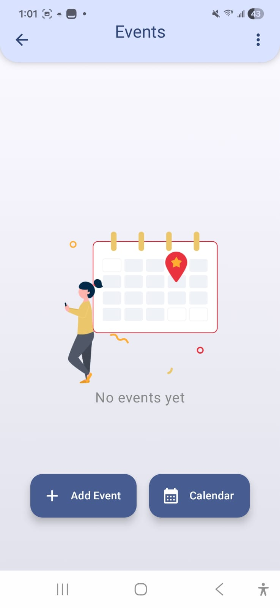
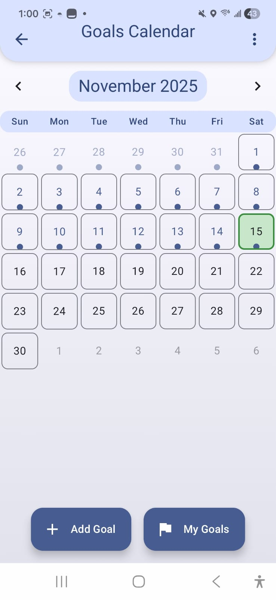
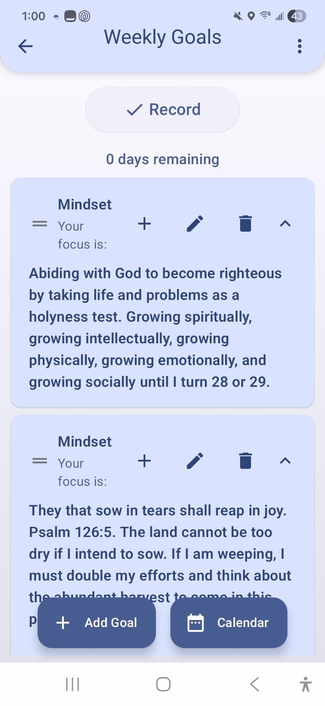
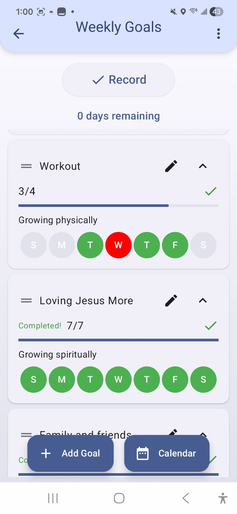
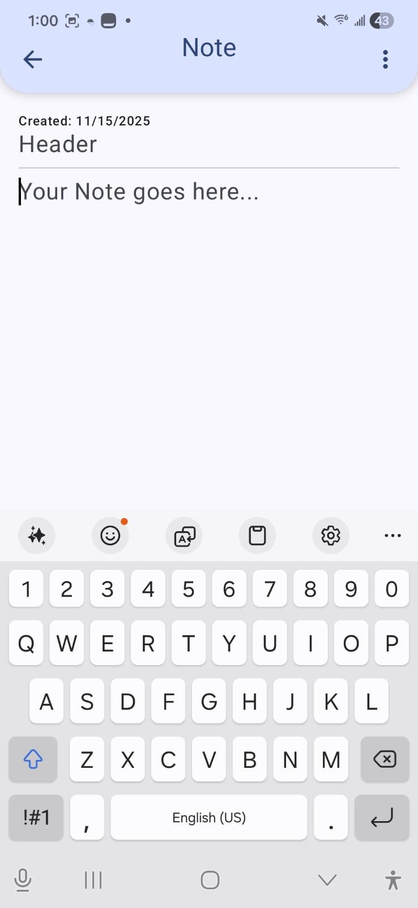
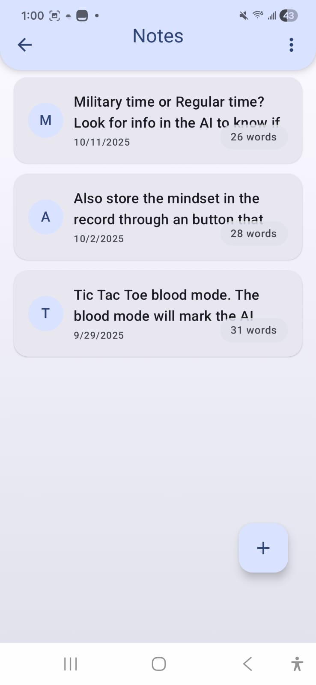

# Multi — Android Productivity Suite

A modern multi-feature productivity hub built with Kotlin and Jetpack Compose.

Multi combines Notes, Events, Weekly Goals, and Calendar views into a unified, animated, and theme-adaptive workspace. Built to demonstrate production-level Android development practices including Compose UI, Room persistence, animations, navigation, and modern architecture.

## 🏗 Architecture

The Notes feature follows an **MVVM + repository** design: `NotesActivity` is a
thin Compose renderer, `NotesViewModel` owns state as a single
`StateFlow<NotesUiState>`, and a `NotesRepository` interface abstracts Room so
the ViewModel can be unit-tested against an in-memory fake with no device. A
small `ServiceLocator` wires it together. See **[ARCHITECTURE.md](ARCHITECTURE.md)**
for the diagram and the migration plan for the rest of the app.

Every push and pull request runs unit tests, Android Lint and a debug build in
[GitHub Actions](.github/workflows/ci.yml). Contribution guide:
**[CONTRIBUTING.md](CONTRIBUTING.md)**.

✨ Features
🧭 Animated Medallion Navigation

Interactive animated medallion home screen

Fast switching between Notes, Calendar, Events, and Weekly Goals

Remembers last-visited workspace

Respects light/dark theme preferences

## 📸 Screenshots

### Events — Empty State

### Goals Calendar

### Goals List

### Weekly Goals

### Note Editor

### Notes List

📝 Notes Workspace

Rich note editor with keyboard-safe scrolling

File and image attachments

Import & export to DOCX, TXT, and PDF

Bulk actions (multi-select delete/restore/move)

Integrated Trash Bin with 30-day retention

📅 Events & Scheduling

Scrollable Kizitonwose Calendar for quick browsing

Expandable event cards with titles, descriptions, and times

Configurable local notifications

Map deep links for location-based events

Attach notes to events for richer context

🎯 Weekly Goals

Drag-and-drop reordering

Persistent “mindset” cards

Automatic weekly rollover (Sunday-based logic)

Confetti and animations for accomplishments

Tracks daily completions across sessions

🗄 Unified Room Database

One schema powering Notes, Events, Weekly Goals, and Trash

Entity mappers for clean data flow

Database migrations included

MVVM architecture with state-driven Compose UI

🛠 Tech Stack

Kotlin 2.0

Jetpack Compose · Material Design 3

MVVM · Repository pattern · `StateFlow` / `collectAsStateWithLifecycle`

Room Database (with migrations)

Coroutines & Flows

Kizitonwose Calendar · Lottie · Konfetti

JUnit4 · Robolectric · `kotlinx-coroutines-test` (fakes over mocks)

GitHub Actions CI · Android Lint

Git / GitHub (multi-branch workflow)

🚀 Getting Started
Prerequisites

Android Studio Hedgehog or later

JDK 11+

Android SDK installed

🔧 Building the App
Using Android Studio

Open the project in Android Studio

Allow dependency syncing

Run the app on a device/emulator

Command Line

Build the debug APK:

./gradlew assembleDebug

Run tests:

./gradlew test

APK output:
app/build/outputs/apk/debug/

🗑 Trash Bin

Deleted notes and items move to a temporary Trash Bin and stay there for 30 days unless restored or permanently deleted earlier.

📍 Project Link

https://github.com/SamuelPinoP/Multi

